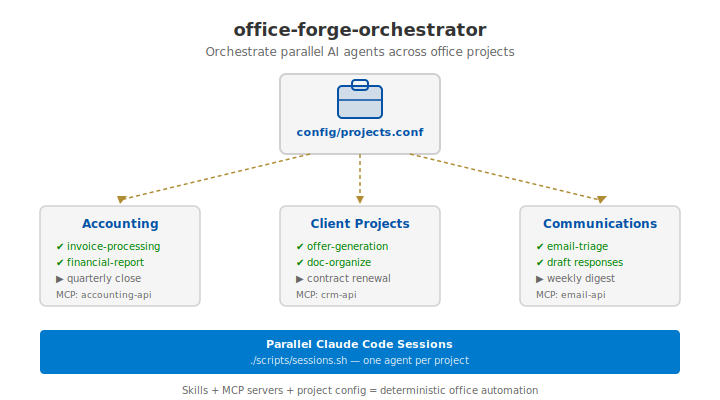

<!-- markdownlint-disable MD033 -->
# office-forge-orchestrator

Orchestrate parallel AI agents across office projects
(invoices, contracts, reports, email) from a single
workspace — the way [polyforge](https://github.com/qte77/polyforge) manages dev repos.

**For** office workers and ops teams running Claude Code
across multiple projects simultaneously.
**Run** `./scripts/sessions.sh` to open parallel agent
sessions — one per project.

## Quick Start

```bash
./scripts/status.sh              # See all managed projects
./scripts/sessions.sh            # Parallel CC sessions
./scripts/run.sh "task" ./dir/   # Run task across projects
```

Projects: edit `config/projects.conf`. Credentials:
see `config/` for environment setup.

<details>
  <summary>Workspace preview — orchestrator concept with parallel agent sessions</summary>
  
</details>

## Docs

- [Skills](.claude/skills/) — deterministic office workflows (invoice, contract, report)
- [MCP servers](mcp/) — business API configs (accounting, CRM, email)
- [Templates](templates/) — project scaffolds for common scenarios
